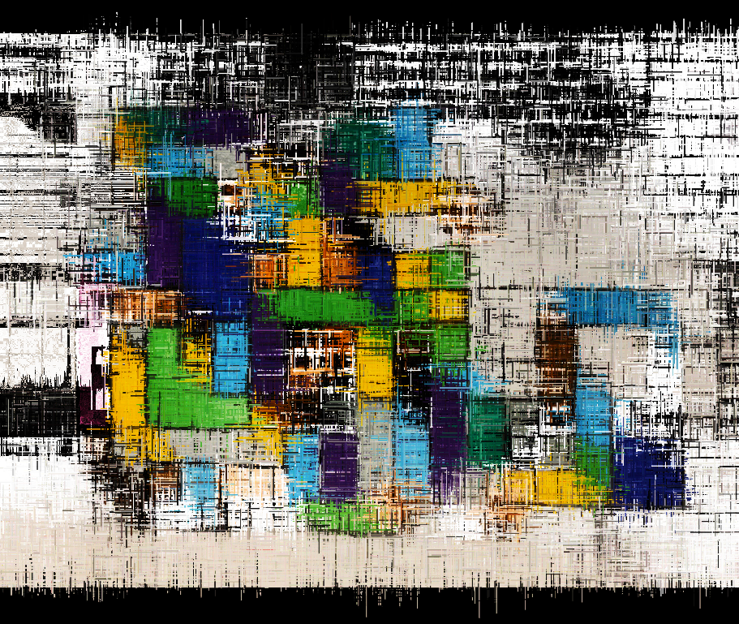

# Entropic Noise

A noise-guided multi-walker generative drawing tool built with p5.js. It makes pretty lines and stuff

*Minimalistic drawing fun - not trying to be anything other than what it is.*

**[Try it live!](https://OliviaLaBorde.github.io/entropic_noise/)**

Here's some stuff to look at:

Photo Sampling:

Photo Sampling:

Photo Sampling:

Photo Sampling - Brush preset: cityBuilder

Default Perlin Noise - Low pushAmount

 

## What It Does

Entropic Noise is a **creative drawing thingy** that does some things
- **Autonomous Generative Patterns** - set parameters and watch the pretty patterns
- **Different Kinds of Noise!** - math is mean
- **Photo Reconstruction** - take colors from images to create textured versions
- **Sound Reactive** - it can listen to you and adjust params according to how stupid you sound yelling into the mic

## Features

- **It's got a UI that does stuff** - its honestly a mess with params all thrown about - kinda like my life :D
- **It's got colors** ...gay ones too
- **It's got oscillations!** - it does I promise
- **Its got a preset system thingy**
- **You can press keys and then it does stuff**

## Quick Start

1. Host `dist/index.html` 
2. Use UI to make things different and stuff
3. Draw with ur mouse thingy
4. Experiment
5. Save it and put on fridge - mom will be proud
6. Eat some cheese dip - you deserve it good job

## Keyboard Shortcuts

- **H** - Hide/Show all UI panels
- **C** - Clear canvas
- **A** - Toggle Auto Draw mode
- **R** - Reset walkers and noise

## Core Algorithm

The system uses **bundled noise-guided walkers**:

 - **Multiple Walkers** - up to 1000 of those little guys
 - **Noise Guidance** - Each walker follows a unique noise path - try different ones! some flock in, some dont, and some just dont care about your needs at all
 - **Offset Noise Maps** - Walkers can have offset starting noise coordinates, but that makes it less entropy-ee - it's your life tho so whatever
 - **Parametric Control** - Every aspect is controllable: spread, push, opacity, color, brush count, push offset, noise map offset x, moise map offset y, spread amount, line offset x, line offset y, line offset times, fixed angle, update XY, always step, spread oscillation, spread oscillation amplitude, allow funky, noise model, noise parameters, boundary shape, color mode, stroke width, blend mode, back ground color, color cycling hue min, color cycling hue max, colllor cyccling saturation min, clolor cycleing saturation max, ccoklkorrrr cycifng bightness min, clr cclng briughtness max, cohfol cycling cycle speeeed, clcllooor saturashun cycle sped, clololor psychic brightness cycle spd, use mic, mic gain, mic formula, fft flux gain, fft flux low gate, fft excite curve, auto draw, show source image, show source image, draw source on canvas, glitch amount, glitch chaos, clear canvas, reset walkers, help and stuff, export png, load background image, select preset, apply preset, load preset file, save current settings as preset.... I think that's about all of em. - oh wait we also got clolor cycling color presets like monochrome and earth tones, and warm tones, and cool tones, and a full on gaaaaayyy one too!

### Key Parameters

- **Base Spread** - How far walkers wander from their home
- **Push Amount** - Step size (lower = calm, higher = crazy)
- **Brush Count** - Number of simultaneous walkers
- **Stroke Width & Opacity** - Line looks maxxing
- **Color Controls** - colors, cycling, blend mode, or image sampling

## Creating Presets

Save your favorite brush behaviors:

1. Adjust parameters to taste
2. Click "Save Preset" in the Presets folder
3. Name your preset
4. Share the JSON file with others and make frens!

**Tip:** You can omit color properties from presets to create behavior-only brushes that preserve your current color settings.

## Known Bugs
... sure, we have a lot

You can tell me about them if you wanna

