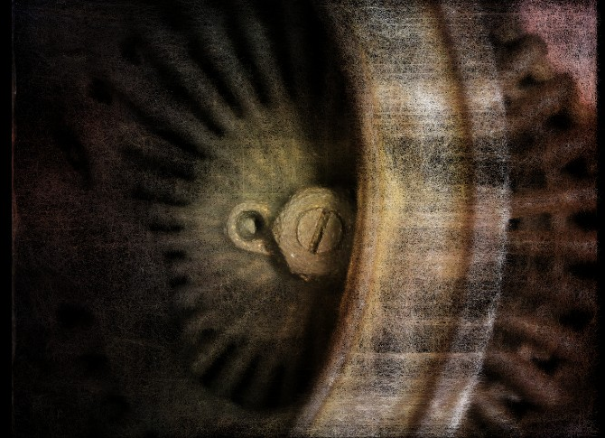
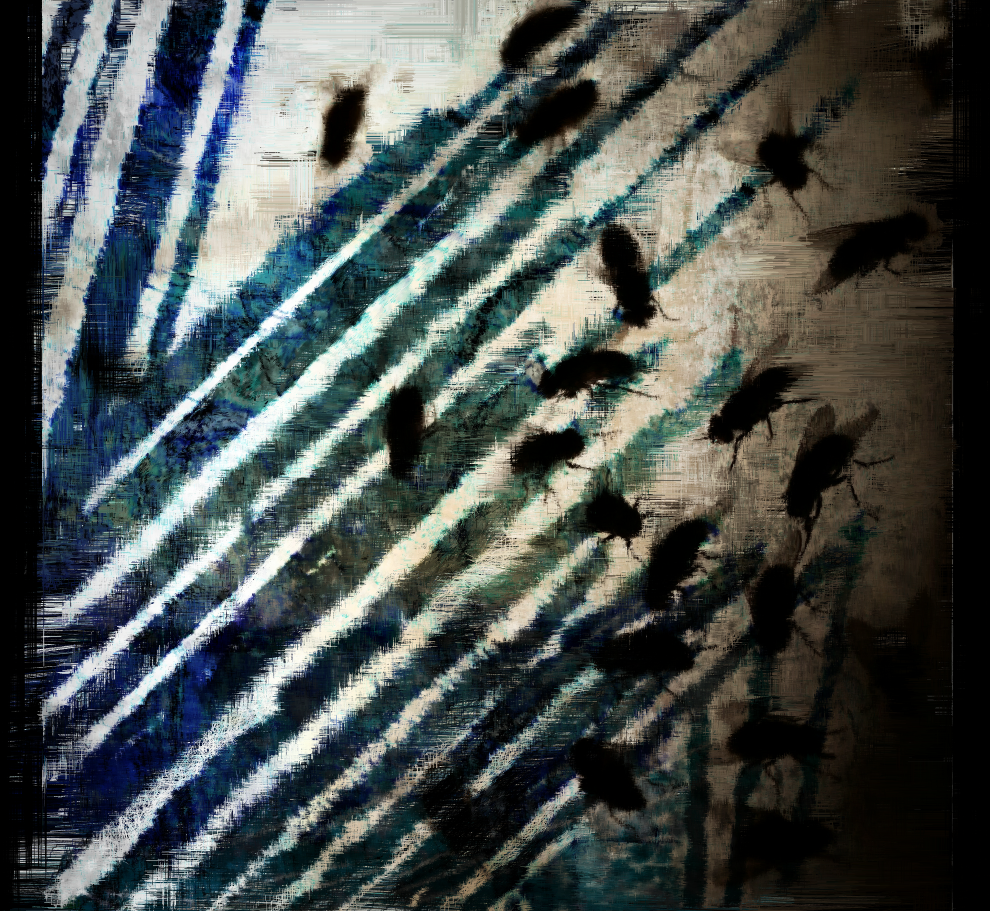
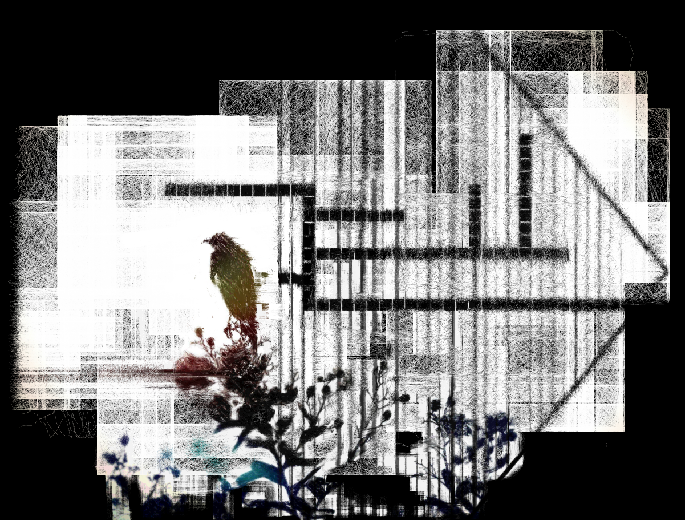
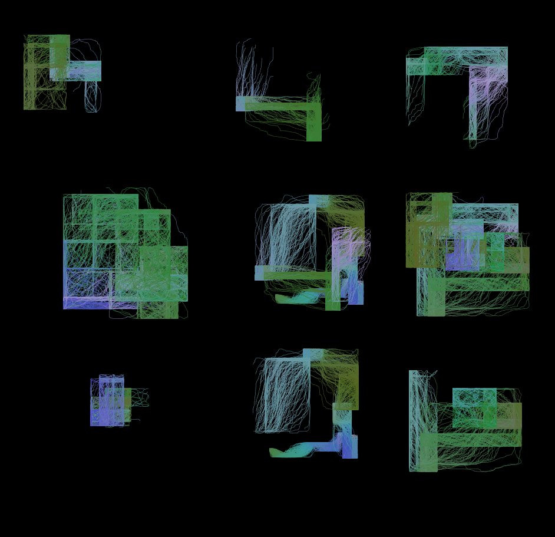
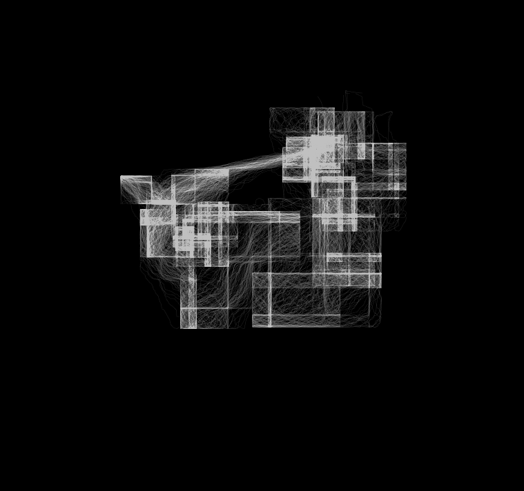

# Entropic Noise

A noise-guided multi-walker generative drawing tool built with p5.js. It makes pretty lines and stuff

*Minimalistic drawing fun - not trying to be anything other than what it is.*

**[Try it live!](https://OliviaLaBorde.github.io/entropic_noise/)**

Here's some stuff to look at:

 

## What It Does

Entropic Noise is a **creative drawing instrument** that does some things
- **Autonomous Generative Patterns** - Set parameters and watch the pretty patterns
- **Gestural Performance Drawing** - Direct mouse control with algorithmic enhancement  
- **Photo Reconstruction** - Sample colors from images to create textured reinterpretations
- **Architectural/Geometric** - Fixed-angle mode for structured compositions if you like right angles :D

## Features

- **It's got a UI that does stuff**
- **It's got colors**
- **It can hear you through your mic and alter settings based on amplitude** - if you allow it to :/
- **Its got a preset system thingy**
- **You can press keys and then it does stuff**

## Quick Start

1. Host `dist/index.html` 
2. Use UI to make things different and stuff
3. Draw with ur mouse thingy
4. Experiment
5. Save it and put on fridge - mom will be proud
6. Eat some cheese dip - you deserve it 

## Keyboard Shortcuts

- **H** - Hide/Show all UI panels
- **C** - Clear canvas
- **A** - Toggle Auto Draw mode
- **R** - Reset walkers and noise
- **SHIFT** - Toggle legacy UI - don't look tho its real ugly

## Core Algorithm

The system uses **bundled noise-guided walkers**:

1. **Multiple Walkers** - Each bundle contains many independent walkers (1-999+)
2. **Noise Guidance** - Each walker follows a unique Perlin noise path
3. **Offset Noise Maps** - Walkers have slightly offset noise coordinates for variation
4. **Low Opacity Layering** - Accumulation creates texture and depth
5. **Parametric Control** - Every aspect is controllable: spread, push, opacity, color, etc.

### Key Parameters

- **Base Spread** - How far walkers wander from center
- **Push Amount** - Step size (lower = smoother, higher = chaotic)
- **Brush Count** - Number of simultaneous walkers
- **Stroke Width & Opacity** - Line appearance
- **Color Controls** - Fixed colors, cycling, or image sampling

## Creating Presets

Save your favorite brush behaviors:

1. Adjust parameters to taste
2. Click "Save Preset" in the Presets folder
3. Name your preset
4. Share the JSON file with others and make frens!

**Tip:** You can omit color properties from presets to create behavior-only brushes that preserve your current color settings.

## Known Bugs
... sure, we have some

You can tell me about them if you wanna

